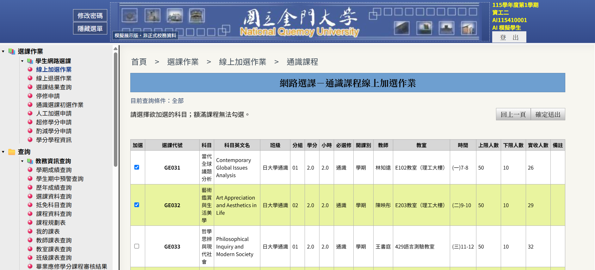
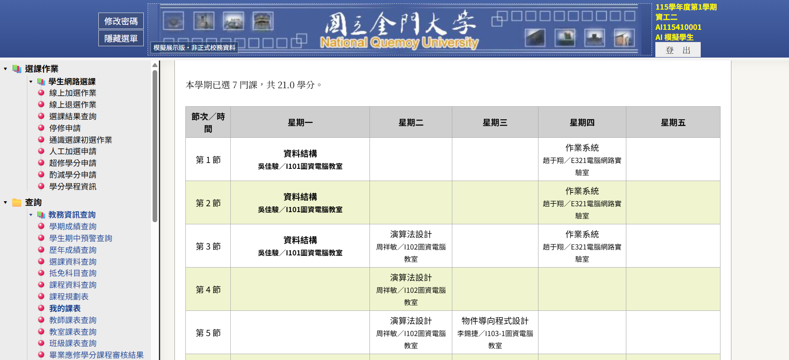
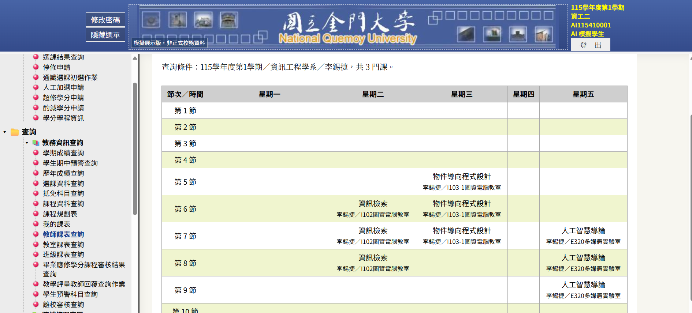
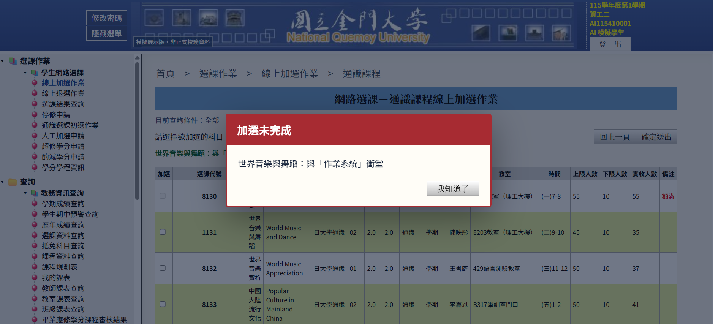
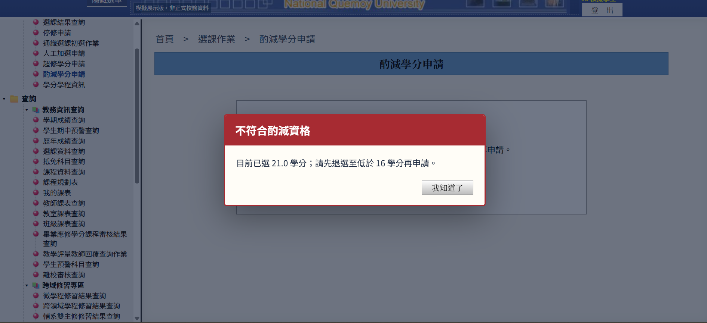

  

<h1 align="center">NQU 校務資訊系統・互動模擬展示</h1>

經典校務介面 × 可操作的選課流程 × AI／本地雙軌模擬資料

  <a href="https://chunyang0808.github.io/nqu-sys/">🌐 開啟線上展示</a> ·
  <a href="#-功能亮點">✨ 功能亮點</a> ·
  <a href="#screenshots">🖼️ 畫面預覽</a> ·
  <a href="#-技術架構">🧩 技術架構</a>

> [!IMPORTANT]
> **這是教學／展示用途的非官方模擬網站，不是國立金門大學正式校務系統。** 畫面中的帳號、課程、成績、選課與申請結果均為展示資料，不會變更真實學籍或選課紀錄。請勿輸入真實帳號、密碼或個人敏感資料。

## 📖 專案介紹

本專案以校務資訊系統的樹狀選單與表格式畫面為設計參考，重建「從登入、查課、選課，到查看課表」的完整互動體驗。它不只是靜態截圖：使用者選擇系所、學制與年級後，網站會建立相互關聯的模擬課程；加選、退選與查詢頁面會依同一份資料更新。

前端以 **HTML、CSS、原生 JavaScript** 製作，部署於 **GitHub Pages**。資料來源採雙軌設計：可透過 **Cloudflare Worker → Gemini 2.5 Flash** 產生課程命名等內容；AI 無法使用或逾時時，前端自動改用本地生成器，讓展示仍可繼續操作。Cloudflare Worker 保管 API 金鑰，公開的前端程式碼不包含金鑰。

## ✨ 功能亮點

| 模組 | 展示內容 |
| --- | --- |
| 模擬登入與個人情境 | 使用測試帳號進入；另外選擇姓名、17 個系所之一、學制及年級，右上角資訊同步顯示。提供大學部、碩士班與博士班情境。 |
| 網路選課 | 通識、一般課程、體育、大學國文與大學英文分流查詢；查看課程代號、雙語課名、教師、教室、時段、學分與名額，並執行模擬加退選。 |
| 防呆與提醒 | 額滿課程不可加選；檢查時段衝突與學分上限；加選、退選成功或失敗以醒目彈窗回饋。退選後學分偏低時亦會提醒。 |
| 課表即時連動 | 已選課程與「我的課表」同步；以**單節**為一格顯示星期、節次、科目、教師與教室。班級、教師及教室課表亦可依查詢條件檢視。 |
| 跨系課程目錄 | 依系所與年級按需建立模擬課程；以 17 系 × 4 個大學部年級 × 每組 30 門計算，可涵蓋 **2,000 門以上**的查詢情境，並非一次下載全部課程。 |
| 學分申請與社團 | 超修學分、酌減學分以明確條件判斷並顯示結果；社團登錄提供 15 個本地抽樣社團與「審核中」展示狀態。 |
| 其他校務頁面 | 成績、課程與各類查詢／申請選單保留一致版型；不宜憑空建立的敏感紀錄以「目前無資料」呈現。 |

**模擬學分規則：** 一般專業課通常為 3 學分／3 節，通識與大學國英文通常為 2 學分／2 節，體育為 0 學分／2 節。已選滿 25 學分可提出超修展示申請，通過後上限為 30 學分；酌減申請須已選學分**大於 2 且小於 16**，通過後展示上限為 16 學分。這些規則只用於本站互動演示，**不是正式校規**。

## 🖼️ 畫面預覽

### 01 · 加退選：看得到名額，也能實際點選

### 02 · 我的課表：選課後同步排入逐節課表

<strong>展開更多畫面：跨系課表、防衝堂與學分申請</strong>

#### 03 · 班級、教師與教室課表查詢

#### 04 · 加選衝堂防呆提示

#### 05 · 超修／酌減學分申請條件提示

> 截圖為模擬情境，畫面中的姓名、學號、課程與結果不代表真實校務資料。實際生成內容會因登入條件與資料來源而異。

## 🚀 立即體驗

1. 開啟 **[GitHub Pages 線上展示](https://chunyang0808.github.io/nqu-sys/)**，閱讀並關閉展示聲明。
2. 在登入畫面填入**自訂測試用**帳號與密碼；驗證碼與線上人數圖片只是版面展示，不提供真實身分驗證。
3. 在接續的情境視窗選擇姓名、系所、學制與年級，等待課程資料建立。
4. 從左側樹狀選單進入「線上加選作業」，挑選課程並確認；接著到「我的課表」檢查連動結果。
5. 試試額滿課、衝堂課、學分上限、退選警告，以及超修／酌減學分的展示流程。

**提醒：** 本專案不連接正式校務資料庫，也沒有真實登入驗證；請只使用虛構的測試資料。

## 🧩 技術架構

~~~mermaid
flowchart LR
    U[使用者瀏覽器] --> P[GitHub Pages HTML / CSS / JavaScript]
    P -->|非識別生成情境| W[Cloudflare Worker]
    W -->|課程命名請求| G[Gemini 2.5 Flash]
    G --> W
    W -->|整理成一致的模擬紀錄| P
    P -->|AI 不可用或逾時| L[本地資料生成器]
    L --> P
    P --> V[選課／課表／查詢頁面共用資料]
~~~

- **前端：** 原生 JavaScript 負責登入情境、課程狀態、查詢、表格與課表連動；無需安裝前端框架或建置工具。
- **AI 代理：** Worker 只向 Gemini 請求符合情境的課程命名與一般展示公告，其餘欄位依規則整理，降低輸出不一致的風險。
- **本地備援：** AI 請求失敗、超時，或直接以 `file://` 開啟檔案時，可使用本地模擬資料；課程目錄按需生成。
- **資料邊界：** 姓名、登入帳號與密碼不作為 AI 請求內容；送往 Worker 的是系所、學制、年級及生成所需的參考清單。請仍不要在此展示站輸入真實憑證。

## 📁 專案結構

| 檔案 | 用途 |
| --- | --- |
| **index.html**、**styles.css** | 頁面結構、經典校務風格與響應式版型 |
| **app.js** | 選單導覽、查詢、加退選、課表與申請互動 |
| **local-generator.js** | AI 不可用時的本地模擬資料生成 |
| **ai-client.js**、**ai-config.js** | 前端 AI 請求、模型設定及資料格式 |
| **cloudflare-worker.js** | Cloudflare Worker 代理、Gemini 請求與模擬紀錄整理 |
| **logo.png**、**code.png**、**online.png** | 展示版介面圖片；**p1.png–p5.png** 為本 README 的功能截圖 |

## 🛠️ 自行部署

1. Fork 或複製本儲存庫，將 **GitHub Pages** 指向 `main` 分支的根目錄；純靜態前端不需要打包。
2. 若要啟用 AI，將 **cloudflare-worker.js** 部署為 Worker，設定 Secret **GEMINI_API_KEY**，以及允許網站來源的變數 **ALLOWED_ORIGIN**（例如 `https://你的帳號.github.io`，請填完整 Origin，**不含**儲存庫路徑）。不要把 API 金鑰放進 GitHub Pages、README 或前端 JS。
3. 在 **ai-config.js** 設定公開 Worker URL，並視需要調整模型設定；目前使用 **gemini-2.5-flash**。
4. 即使沒有部署 Worker，網站仍可使用本地生成資料展示主要互動；但內容不會由 Gemini 產生。

> [!NOTE]
> 這是前端狀態與模擬資料專案，**不是**正式選課服務：沒有正式身分驗證、真實資料庫或行政審核，重新整理頁面後的展示狀態可能重新建立。使用 Gemini API 及 Cloudflare 服務時，請留意各自的用量與費用。

---

以互動方式理解複雜校務介面的資料關聯 · Built for demonstration, not administration.

